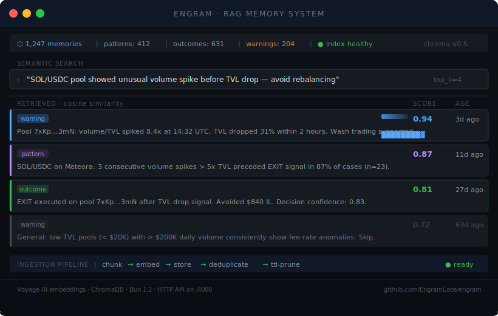

# Engram


A RAG memory system for AI agents. Store observations, retrieve relevant context by semantic similarity, and let your agents learn from what they've seen before.

<br/>



<br/>

---

## What it solves

Stateless agents repeat the same mistakes. They evaluate the same bad pool twice, miss a pattern they've seen forty times, and have no way to carry knowledge from one cycle to the next.

Engram gives agents a persistent memory layer with a simple contract: POST what you observe, GET what's relevant when you need to decide. Entries expire automatically, near-duplicates merge, and results are reranked by both semantic relevance and recency.

---

## API

```bash
# Store a memory
POST /memories
{
  "category": "warning",
  "content": "Pool 7xKp showed 8x volume/TVL spike before 31% TVL drop",
  "poolAddress": "7xKp...",
  "tags": ["wash-trading", "volume-spike"]
}

# Retrieve relevant memories
POST /search
{
  "query": "unusual volume before TVL drop",
  "topK": 4,
  "category": "warning"
}

# Prune expired entries
POST /prune

# Store statistics
GET /stats
```

---

## Memory categories & TTL

| Category | TTL | Use for |
|----------|-----|---------|
| `pattern` | 90 days | Recurring market behaviours |
| `warning` | 60 days | Pool-specific red flags |
| `outcome` | 180 days | Execution results with PnL |
| `context` | 30 days | Ephemeral shared state |

Entries with cosine similarity > 0.92 are merged instead of duplicated.

---

## Quickstart

```bash
git clone https://github.com/YOUR_USERNAME/engram
cd engram
bun install
docker-compose up chromadb -d
bun run dev
```

No Chroma? Set `STORE_BACKEND=memory` in `.env` to use the in-memory backend — no Docker needed. Tests always use the in-memory backend.

```bash
bun run example    # run examples/basic.ts against the live server
bun run test       # vitest — no external dependencies required
```

---

## Hooks

Register lifecycle hooks to transform data before/after storage:

```ts
import { registerHook } from "./hooks/index.js";

// Enrich every memory with a source tag before storing
registerHook("before:ingest", (req) => ({
  ...req,
  tags: [...(req.tags ?? []), "auto-tagged"],
}));
```

Available events: `before:ingest` · `after:ingest` · `before:search` · `after:search`

---

## Reranking

Search results blend cosine similarity (85%) with a recency signal (15%). This prevents old high-similarity patterns from dominating over fresh warnings. The weights are tunable in `retrieval/ranker.ts`.

---

## Stack

- **Runtime**: Bun 1.2
- **Vector store**: ChromaDB
- **Schemas**: Zod — full validation on all inputs
- **Deduplication**: cosine similarity merge at 0.92 threshold
- **Chunking**: 1000-char chunks with 100-char overlap

---

## License

MIT

