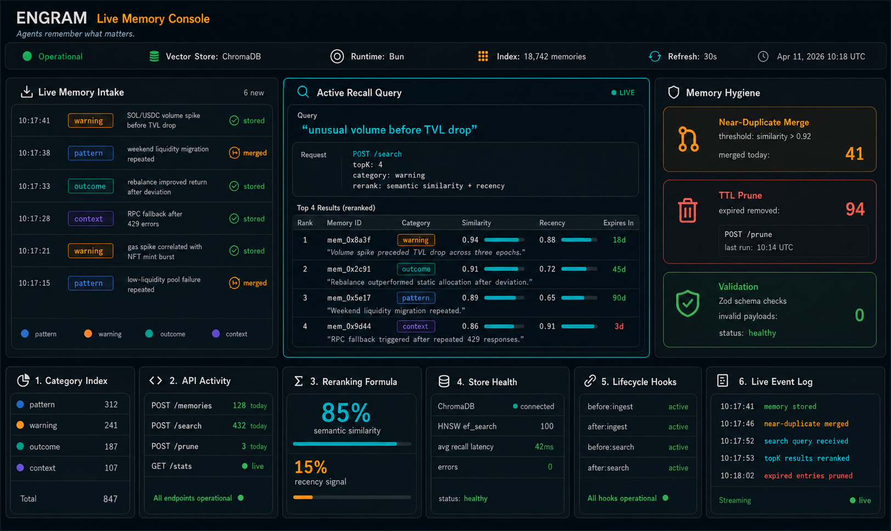
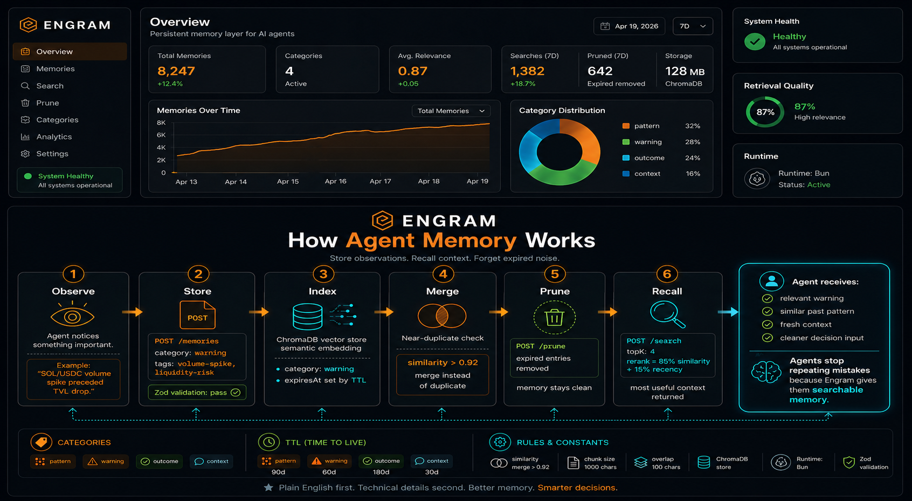

# Engram


A RAG memory system for AI agents. Store observations, retrieve relevant context by semantic similarity, and let your agents learn from what they've seen before.

## Live Memory Console



Live memory console for Engram: memory intake, active recall queries, top reranked results, memory hygiene, category index, API activity, store health, lifecycle hooks, and event logs for the persistent agent memory layer.

## How Agent Memory Works



How Engram turns observations into searchable memory: store events, embed and index them in ChromaDB, merge near-duplicates, prune expired noise, and recall the most useful context before the next agent decision.

---

## What it solves

Stateless agents repeat the same mistakes. They evaluate the same bad pool twice, miss a pattern they've seen forty times, and have no way to carry knowledge from one cycle to the next.

Engram gives agents a persistent memory layer with a simple contract: POST what you observe, GET what's relevant when you need to decide. Entries expire automatically, near-duplicates merge, and results are reranked by both semantic relevance and recency.

---

## API

```bash
# Store a memory
POST /memories
{
  "category": "warning",
  "content": "Pool 7xKp showed 8x volume/TVL spike before 31% TVL drop",
  "poolAddress": "7xKp...",
  "tags": ["wash-trading", "volume-spike"]
}

# Retrieve relevant memories
POST /search
{
  "query": "unusual volume before TVL drop",
  "topK": 4,
  "category": "warning"
}

# Prune expired entries
POST /prune

# Store statistics
GET /stats
```

---

## Memory categories & TTL

| Category | TTL | Use for |
|----------|-----|---------|
| `pattern` | 90 days | Recurring market behaviours |
| `warning` | 60 days | Pool-specific red flags |
| `outcome` | 180 days | Execution results with PnL |
| `context` | 30 days | Ephemeral shared state |

Entries with cosine similarity > 0.92 are merged instead of duplicated.

---

## Quickstart

```bash
git clone https://github.com/YOUR_USERNAME/engram
cd engram
bun install
docker-compose up chromadb -d
bun run dev
```

No Chroma? Set `STORE_BACKEND=memory` in `.env` to use the in-memory backend — no Docker needed. Tests always use the in-memory backend.

```bash
bun run example    # run examples/basic.ts against the live server
bun run test       # vitest — no external dependencies required
```

---

## Hooks

Register lifecycle hooks to transform data before/after storage:

```ts
import { registerHook } from "./hooks/index.js";

// Enrich every memory with a source tag before storing
registerHook("before:ingest", (req) => ({
  ...req,
  tags: [...(req.tags ?? []), "auto-tagged"],
}));
```

Available events: `before:ingest` · `after:ingest` · `before:search` · `after:search`

---

## Reranking

Search results blend cosine similarity (85%) with a recency signal (15%). This prevents old high-similarity patterns from dominating over fresh warnings. The weights are tunable in `retrieval/ranker.ts`.

---

## Stack

- **Runtime**: Bun 1.2
- **Vector store**: ChromaDB
- **Schemas**: Zod — full validation on all inputs
- **Deduplication**: cosine similarity merge at 0.92 threshold
- **Chunking**: 1000-char chunks with 100-char overlap

---

## Technical Spec

### Vector Store — ChromaDB HNSW

Engram uses ChromaDB's default HNSW index (`hnswlib`). Relevant parameters:

| Parameter | Default | Effect |
|-----------|---------|--------|
| `M` | 16 | Graph connectivity — higher = better recall, more RAM |
| `ef_construction` | 200 | Build-time search width — higher = better index quality, slower build |
| `ef_search` | 100 | Query-time search width — raise for higher recall at cost of latency |

For a store with < 50k entries, defaults are fine. Above 100k entries, raise `ef_search` to 150–200 to maintain recall.

### Near-Duplicate Merge

Chroma returns **cosine distance** (0 = identical, 2 = maximally dissimilar). The merge threshold is:

```
similarity = 1 − distance
merge if distance < 1 − 0.92 = 0.08
```

When a near-duplicate is detected, Engram refreshes the existing entry's `expiresAt` rather than inserting a duplicate. This prevents the same recurring observation (e.g., pool warning seen 20× in a week) from bloating the collection with semantically identical entries.

### Reranking Formula

Results blend cosine similarity with a recency signal using **exponential decay** (half-life 30 days):

```
recencyScore = exp(−age / 30d_in_ms)
blended = similarity × 0.85 + recencyScore × 0.15
```

A 90-day-old entry scores `exp(−3) ≈ 0.05` on recency. With linear decay it would score `0.33` — enough to displace a fresh warning with slightly lower similarity. Exponential decay prevents this.

### TTL Enforcement

TTL is applied at two points:
1. **On search** — entries past `expiresAt` are filtered out before results are returned (no Chroma re-query needed)
2. **On prune** — `POST /prune` (or scheduled `PRUNE_INTERVAL_HOURS`) does a full collection scan and deletes expired IDs in batch

Prune is O(n) on collection size, so schedule it during low-traffic periods on large stores.

### Chunking Strategy

Input text is split at sentence boundaries (`.` followed by space) to preserve semantic coherence:
- Max chunk size: 1000 chars (~250 tokens — well within the 512-token embedding model limit)
- Overlap: 100 chars — ensures context at chunk boundaries doesn't vanish
- Multi-chunk entries are prefixed `[1/3]`, `[2/3]`, etc. for debugging

### /metrics Endpoint

`GET /metrics` returns Prometheus-compatible text:
```
engram_entries_total 847
engram_entries_by_category{category="pattern"} 312
engram_entries_by_category{category="warning"} 241
engram_entries_by_category{category="outcome"} 187
engram_entries_by_category{category="context"} 107
engram_pruned_total 94
```

---

## License

MIT

